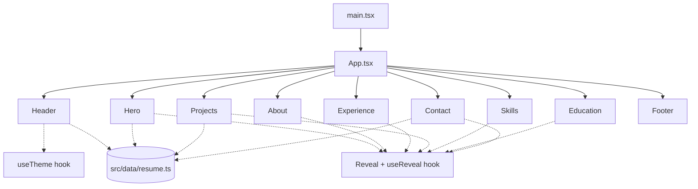

# Mateo Robinson — Personal Website

[](https://github.com/MateoRobinsonn/Personal-Website/actions/workflows/deploy.yml)


[](./LICENSE)

My personal portfolio — a fast, component-based single-page site built the way a small
production frontend at a company would be: React + TypeScript on Vite, Tailwind for styling,
oxlint for linting, and GitHub Actions for CI/CD straight to GitHub Pages.

**🌐 Live site:** https://mateorobinsonn.github.io/Personal-Website/
*(deploys automatically from `main` — see [Deployment](#deployment). If that link is ever down, the
[Run it locally](#run-it-locally) section below gets you the exact same site on your machine.)*

---

## Table of Contents

- [Features](#features)
- [Tech stack](#tech-stack)
- [Run it locally](#run-it-locally)
- [Project structure](#project-structure)
- [Content is data-driven](#content-is-data-driven)
- [Deployment](#deployment)
- [Performance](#performance)
- [License](#license)

## Features

- **Light / dark mode** — follows your OS preference on first visit, then remembers your
  choice (`localStorage`), with no flash-of-wrong-theme on load.
- **Scroll-reveal transitions** — sections fade/slide in via a single shared
  `IntersectionObserver`, not a scroll-event listener, so it stays smooth on low-power hardware.
- **Fully responsive** — mobile nav with an animated slide-down menu, fluid type and grid
  layouts from small phones up to wide desktop monitors.
- **Accessible by default** — semantic landmarks, visible focus states, and full support for
  `prefers-reduced-motion` (animations are skipped entirely if the OS asks for it).
- **Zero external runtime requests** — system font stack and self-contained SVG icons, so
  there's no waiting on Google Fonts or an icon CDN before the page is usable.

<details>
<summary><strong>Click to expand: component / render flow</strong></summary>



`resume.ts` is the single source of truth for content — every section reads from it, so
updating a job, project, or skill means editing one file instead of hunting through markup.
</details>

## Tech stack

| Layer         | Choice                                   | Why                                                         |
| ------------- | ----------------------------------------- | ------------------------------------------------------------ |
| Framework     | [React 19](https://react.dev/)            | Component model matches how real product teams structure UI |
| Language      | [TypeScript](https://www.typescriptlang.org/) | Typed content model, safer refactors                     |
| Build tool    | [Vite](https://vite.dev/)                 | Instant HMR in dev, small optimized production bundle       |
| Styling       | [Tailwind CSS 4](https://tailwindcss.com/) | Utility-first, ships only the CSS actually used             |
| Linting       | [oxlint](https://oxc.rs/)                  | Rust-based, near-instant lint feedback                      |
| CI/CD         | [GitHub Actions](https://github.com/features/actions) | Lint + build on every PR, auto-deploy `main` to Pages |
| Hosting       | [GitHub Pages](https://pages.github.com/)  | Free static hosting, wired up via Actions below              |

## Run it locally

The live link above is the intended way to view this — but if it's ever unreachable (DNS hiccup,
GitHub Pages outage, you're offline, etc.), the whole site runs identically on your machine:

**Prerequisites:** [Node.js](https://nodejs.org/) 20+ and npm.

```bash
git clone https://github.com/MateoRobinsonn/Personal-Website.git
cd Personal-Website
npm install
npm run dev
```

Then open the URL Vite prints (defaults to `http://localhost:5173`).

Other scripts:

```bash
npm run build     # type-check + production build → dist/
npm run preview   # serve the production build locally
npm run lint      # run oxlint
npm run deploy    # build and push dist/ to the gh-pages branch manually
```

## Project structure

<details>
<summary><strong>Click to expand</strong></summary>

```
Personal-Website/
├── .github/workflows/deploy.yml   # CI: lint + build on PRs, deploy on push to main
├── public/
│   ├── favicon.svg
│   └── Mateo-Robinson-Resume.pdf  # served for the "Resume" download button
├── src/
│   ├── components/                # one component per section, plus shared UI (Header, Reveal, icons)
│   ├── data/resume.ts             # all resume content, typed
│   ├── hooks/                     # useTheme, useReveal
│   ├── App.tsx                    # composes the page from sections
│   ├── main.tsx                   # React entry point
│   └── index.css                  # Tailwind + theme tokens + reveal/animation utilities
├── index.html                     # Vite entry HTML (theme pre-hydration script lives here)
└── vite.config.ts
```

</details>

## Content is data-driven

Every section — experience, projects, skills, education — renders from
[`src/data/resume.ts`](./src/data/resume.ts). To update the site after a resume change, edit
that file; no component markup needs to change.

## Deployment

This repo deploys itself: [`.github/workflows/deploy.yml`](./.github/workflows/deploy.yml) lints
and builds every push/PR, and on a push to `main` it publishes `dist/` to **GitHub Pages**
automatically. To enable it on a fresh clone/fork: repo **Settings → Pages → Source → GitHub
Actions**, then push to `main`.

Prefer a different static host?

- **Manual GitHub Pages push:** `npm run deploy` (uses the `gh-pages` package).
- **Vercel / Netlify / Cloudflare Pages:** build command `npm run build`, output directory
  `dist`, and set `VITE_BASE_PATH=/` (these hosts serve from the domain root, unlike a GitHub
  Pages *project* site which lives under `/Personal-Website/`).

## Performance

Built to stay smooth on modest, older laptops in any modern browser (Chrome, Firefox, Safari,
Edge):

- No animation library — transitions are plain CSS (`opacity`/`transform`), which the browser
  can run on the compositor thread instead of the main thread.
- One shared `IntersectionObserver` drives all scroll reveals instead of a `scroll` listener.
- Tailwind ships only the utility classes actually referenced — the whole stylesheet is a few KB
  gzipped.
- No icon font or icon library — a handful of inline SVGs instead.
- Production `vite build` output: **~75 KB JS / ~7 KB CSS gzipped** for the entire site.

## License

[MIT](./LICENSE) — feel free to fork this as a starting point for your own portfolio.
